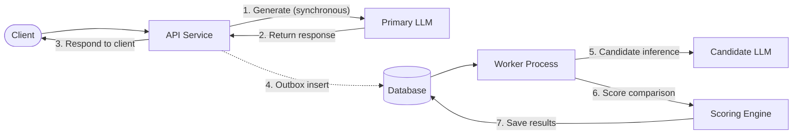

# LLM Evaluator

A service for evaluating candidate language models against live production traffic without adding latency to user requests.

---

## Demo

https://github.com/user-attachments/assets/e0042814-d368-45a3-a6c0-d640a230fef8

## Overview

Upgrading or replacing an LLM in production carries risk. Offline evaluations and synthetic benchmarks often fail to capture real-world user queries and edge cases, while routing live traffic directly to an untested model can lead to user-facing regressions.

LLM Evaluator implements shadow evaluation (dark traffic) to address this:

1. **User requests are served immediately**: The primary model generates and returns its response directly to the client with zero latency overhead.
2. **Background sampling**: A configurable percentage of requests is recorded in a transactional database outbox.
3. **Candidate inference**: A background worker process calls the candidate model using the same prompt.
4. **Automated scoring**: A comparison engine (either lexical heuristics or an LLM judge) scores the candidate's output against the primary model's output on a 0–100 scale.
5. **Review**: Side-by-side responses and evaluation metrics can be inspected through a web dashboard or queried via REST APIs.

---

## Features

- **Zero user latency impact**: Primary responses return synchronously; candidate execution and scoring happen entirely in background workers.
- **Transactional outbox**: Evaluation jobs are written to the database in the same transaction as the request record, ensuring no jobs are dropped even if downstream message brokers or candidate endpoints experience transient outages.
- **Pluggable scoring**:
  - *Heuristic scorer*: Fast, local lexical evaluation combining normalized text similarity, token overlap F1, and length ratio.
  - *LLM judge*: Semantic grading using an impartial model with natural-language reasoning.
- **Web dashboard**: Local browser interface to submit test prompts, inspect side-by-side completions, and track aggregate pass/fail metrics.
- **OpenAI-compatible**: Works with OpenAI, Groq, Together AI, Ollama, vLLM, LiteLLM, or any custom endpoint exposing an OpenAI-compatible interface.
- **Flexible queue backends**: Built-in transactional database queue (PostgreSQL / SQLite), AWS SQS, or Azure Service Bus.
- **Local development runner**: A single runner script (`python run.py`) starts the API and worker together with mock models and local SQLite storage.

---

## Architecture and Workflow



### Job Lifecycle

Evaluation jobs progress through the following stages:

$$\text{queued} \longrightarrow \text{shadow\_running} \longrightarrow \text{score\_queued} \longrightarrow \text{scoring} \longrightarrow \text{complete}$$

If a model call or network operation fails, the worker retries using exponential backoff. Jobs that exhaust configured retry limits are marked as `failed` with error details captured for debugging.

---

## Getting Started

### Prerequisites

- Python 3.10+
- (Optional) Docker and Docker Compose

### Option 1: Local Development Runner

The local runner starts both the FastAPI server and the background worker in a single process manager using SQLite and built-in mock models:

```bash
git clone https://github.com/srikrishna0130/llm-evaluator.git
cd "LLM Judge"
pip install -r requirements.txt
python run.py
```

- Web dashboard: http://localhost:8000
- OpenAPI documentation: http://localhost:8000/docs
- Stop: Press `Ctrl+C` to shut down both the server and worker.

### Option 2: Docker Compose

To run the full stack with PostgreSQL:

```bash
docker compose up --build
```

The service will be accessible at http://localhost:8000.

---

## Usage

### Web Dashboard

Open http://localhost:8000 in your browser:

1. Enter a prompt in the **New evaluation** form and submit.
2. The primary response appears immediately.
3. Once the background worker finishes, the candidate response and comparative score are displayed.
4. The **Overview** and **Recent evaluations** sections display aggregate metrics and historical runs.

### API Documentation

Interactive OpenAPI documentation is available at http://localhost:8000/docs. You can test endpoints, review request bodies, and inspect response schemas directly from the Swagger UI.

---

## Model Configuration

Model settings are configured via environment variables in `.env` (see `.env.example`):

```env
# Sampling fraction (0.0 to 1.0)
SAMPLE_RATE=0.10

# Primary Model (production traffic)
PRIMARY_PROVIDER=openai
PRIMARY_BASE_URL=https://api.openai.com/v1
PRIMARY_API_KEY=your-api-key
PRIMARY_MODEL=gpt-4o

# Candidate Model (model under evaluation)
CANDIDATE_PROVIDER=openai
CANDIDATE_BASE_URL=https://api.openai.com/v1
CANDIDATE_API_KEY=your-api-key
CANDIDATE_MODEL=gpt-4o-mini
```

Primary, candidate, and judge configurations use independent base URLs and credentials, allowing cross-provider comparisons (for example, comparing an OpenAI primary model against an open-source model running on vLLM or Groq).

---

## Scoring Engines

### Heuristic Scorer (`SCORE_BACKEND=heuristic`)

Calculates a blended lexical score (0–100) locally on the CPU without external API calls:

- **Text similarity (55%)**: Sequence matcher ratio between normalized responses.
- **Token overlap (35%)**: Word-level F1 score of shared tokens.
- **Length ratio (10%)**: Length ratio between shorter and longer responses.

Best for catching gross formatting deviations, truncated outputs, or ensuring candidate outputs match the general structure of the primary response at zero cost.

### LLM Judge (`SCORE_BACKEND=llm`)

Uses an independent language model to evaluate response relevance:

```env
SCORE_BACKEND=llm
JUDGE_BASE_URL=https://api.openai.com/v1
JUDGE_API_KEY=your-api-key
JUDGE_MODEL=gpt-4o
```

The judge evaluates candidate outputs strictly on semantic relevance relative to the primary response, returning a numerical score (0–100) along with an explanation.

---

## Queue Backends

Queue backends are configured with `QUEUE_BACKEND`:

| Backend | Value | Description |
|---|---|---|
| Database Outbox | `database` | Consumes directly from the PostgreSQL or SQLite outbox table. Recommended for standard deployments without external message brokers. |
| AWS SQS | `sqs` | Reads from Amazon SQS. Uses standard AWS IAM credentials. Requires `AWS_REGION` and `SQS_QUEUE_URL`. |
| Azure Service Bus | `azure` | Reads from an Azure Service Bus queue. Requires `AZURE_SERVICE_BUS_CONNECTION_STRING` and `AZURE_SERVICE_BUS_QUEUE_NAME`. |

---

## API Reference

| Method | Endpoint | Description |
|---|---|---|
| `POST` | `/api/v1/evaluate` | Generates primary output synchronously and schedules candidate evaluation if sampled. |
| `GET` | `/api/v1/evaluations` | Lists stored evaluations with pagination (`limit`, `offset`). |
| `GET` | `/api/v1/evaluations/{id}` | Retrieves full record for an evaluation, including prompt and model outputs. |
| `GET` | `/api/v1/evaluations/{id}/comparison` | Retrieves score, metrics breakdown, and reason for an evaluation. |
| `GET` | `/api/v1/metrics` | Returns system totals (total, completed, failed counts, average score). |
| `GET` | `/api/v1/health` | Readiness probe verifying database connectivity. |

---

## Testing

Run the automated test suite with pytest:

```bash
python -m pytest -q
```

Tests cover request sampling isolation, transactional outbox operations, state machine transitions, worker retry policies, queue adapters, and scoring implementations.

---

## Project Structure

```
├── app/
│   ├── main.py          # FastAPI application and route handlers
│   ├── pipeline.py      # Evaluation pipeline and worker coordination
│   ├── domain.py        # Pydantic domain models and status enums
│   ├── scoring.py       # Heuristic and LLM Judge scoring implementations
│   ├── llm.py          # LLM client abstractions (OpenAI and mock)
│   ├── database.py      # Database layer and transactional outbox
│   ├── queue.py         # Queue adapters (Database, SQS, Azure)
│   ├── config.py        # Application settings and environment validation
│   └── static/          # Web dashboard assets (HTML, CSS, JS)
├── run.py               # Local process runner (API + worker)
├── docker-compose.yml   # Multi-container Docker configuration
└── tests/               # Automated test suite
```

---

## License

MIT License.
