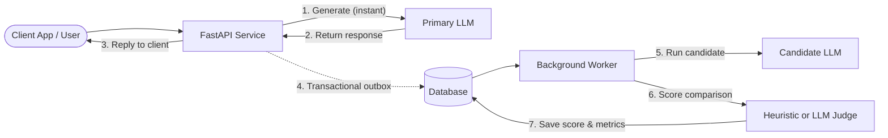

# 🎯 LLM Evaluator

> **Safely evaluate new, cheaper, or fine-tuned LLMs on live production traffic with automated scoring — with zero added latency for your users.**

---

## 💡 What is this for?

Switching Large Language Models (LLMs) in production is stressful:

* You want to switch from an expensive model (e.g. GPT-4o) to a faster, cheaper alternative (e.g. Claude Haiku, Gemini Flash, or a self-hosted Llama 3).
* You want to benchmark a new prompt template, system prompt, or fine-tuned model against your existing setup.
* But **offline benchmarks don't reflect real user behavior**, and testing directly in production risks breaking user experience, degrading output quality, or introducing hallucinations.

### The Solution: Shadow Evaluation (Dark Traffic)

**LLM Evaluator** acts as a safety shield. It uses **shadow evaluation** to benchmark models safely in the background:

```
[ User Request ]
       │
       ▼
 ┌─────────────┐
 │ Primary LLM │ ──────► Instant Response back to User (Zero Latency Penalty!)
 └─────────────┘
       │
       ▼ (Sampled in background)
 ┌──────────────────────┐
 │ Candidate LLM        │ ───► Evaluated by Scorer / LLM Judge ───► Visual Dashboard
 └──────────────────────┘
```

1. **Users get immediate responses**: The primary model replies to user requests instantly. The evaluation never slows down or blocks customer traffic.
2. **Asynchronous shadow calls**: A configurable percentage of live queries (e.g., 5% or 100%) is quietly dispatched to an asynchronous background worker.
3. **Candidate inference**: The background worker sends the exact same prompt to your new candidate model.
4. **Automated comparison & scoring**: A scorer (either a fast lexical heuristic or an intelligent **LLM-as-a-Judge**) compares the candidate's response to the primary model's response, grading relevance from `0` to `100`.
5. **Inspect & monitor**: Review side-by-side outputs, scores, and aggregate metrics in a built-in real-time web dashboard.

---

## ✨ Key Features

* ⚡ **Zero User-Facing Latency**: Primary responses return immediately. Candidate calls and scoring are 100% asynchronous.
* 🛡️ **Resilient Transactional Outbox**: Powered by the transactional outbox pattern. Even if message queues, candidate endpoints, or scorers go down, live traffic is never disrupted or dropped.
* ⚖️ **Dual Scoring Backends**:
  * **Heuristic Scorer**: Completely free, instant lexical metrics (fuzzy sequence match, token overlap F1, and length ratio).
  * **LLM-as-a-Judge**: Uses an LLM to semantically judge relevance and output a 0–100 score with reasoning.
* 📊 **Built-In Web Dashboard**: Beautiful, clean web interface to submit test prompts, watch evaluations resolve in real time, and view aggregate metrics.
* 🔌 **Any OpenAI-Compatible Provider**: Compatible with OpenAI, Anthropic (via proxy), Groq, Together, Ollama, vLLM, or custom internal inference gateways.
* 📬 **Pluggable Queues**: Out of the box supports transactional Database queues (PostgreSQL / SQLite), AWS SQS, or Azure Service Bus.
* 🚀 **Zero-Setup Quickstart**: Ships with built-in mock models and an all-in-one local runner (`python run.py`) that runs out-of-the-box without needing Docker or API keys.

---

## 🔄 How It Works



### Evaluation Lifecycle

Each sampled evaluation moves through a resilient state machine:

$$\text{queued} \longrightarrow \text{shadow\_running} \longrightarrow \text{score\_queued} \longrightarrow \text{scoring} \longrightarrow \text{complete}$$

If an external LLM call or queue fails, the worker automatically retries using bounded exponential backoff. If max retries are exceeded, the job gracefully moves to `failed` without crashing the service.

---

## 🚀 Quickstart

You can test the system locally in less than a minute.

### Option 1: Local Runner (Fastest — No Docker Needed)

Runs both the FastAPI server and background worker in a single terminal with auto-configured SQLite and mock LLMs:

```bash
# 1. Clone repository and install dependencies
git clone https://github.com/srikrishna0130/llm-evaluator.git
cd "LLM Judge"
pip install -r requirements.txt

# 2. Start the local runner
python run.py
```

That's it! 
* Open your browser to **<http://localhost:8000>** to explore the dashboard.
* Interactive API documentation (Swagger) is at **<http://localhost:8000/docs>**.
* Press `Ctrl+C` anytime to cleanly shut down both the API and worker.

### Option 2: Docker Compose (PostgreSQL Stack)

If you prefer running a complete containerized stack with PostgreSQL:

```bash
docker compose up --build
```

Access the dashboard at **<http://localhost:8000>**.

---

## 💻 Trying It Out

### 1. Web Dashboard

Navigate to **<http://localhost:8000>** in your browser:

1. Type any prompt into the **New evaluation** input (e.g., *"Explain quantum computing in two sentences"*).
2. Click **Run evaluation**.
3. Watch the interface display the primary model response immediately, followed by the background candidate model response and the comparative score.
4. Check the **Overview** section for aggregate metrics (total, completed, failed, average score) and **Recent evaluations** to inspect previous runs.

### 2. Interactive Swagger Docs

Navigate to **<http://localhost:8000/docs>** for full OpenAPI interactive documentation:

* Test endpoints directly from the browser UI with the **Try it out** button.
* Inspect request and response schemas, error codes, and field definitions for all endpoints.

---

## ⚙️ Connecting Real Models

To evaluate real models (like OpenAI, Groq, Ollama, or vLLM), create or update your `.env` file (see [`.env.example`](.env.example)):

```env
# Percentage of requests to sample for shadow evaluation (e.g. 10% = 0.10)
SAMPLE_RATE=0.10

# Primary Model (the one serving live users)
PRIMARY_PROVIDER=openai
PRIMARY_BASE_URL=https://api.openai.com/v1
PRIMARY_API_KEY=sk-proj-...
PRIMARY_MODEL=gpt-4o

# Candidate Model (the new model you want to test)
CANDIDATE_PROVIDER=openai
CANDIDATE_BASE_URL=https://api.openai.com/v1
CANDIDATE_API_KEY=sk-proj-...
CANDIDATE_MODEL=gpt-4o-mini
```

> [!TIP]
> **Independent Provider Credentials**: Primary and candidate models use separate environment variables, so you can easily compare models across different providers (e.g., compare an OpenAI primary with an open-source model hosted on Groq or vLLM).

---

## 🧠 Scoring Backends Explained

The evaluator supports two scoring modes:

### 1. Heuristic Scorer (`SCORE_BACKEND=heuristic`)
* **Cost**: $0 (Runs locally on CPU, no external API calls).
* **Speed**: Sub-millisecond.
* **How it works**: Calculates a blended score ($0 - 100$) based on:
  * **Text Similarity (55%)**: Normalized sequence matcher ratio.
  * **Token Overlap (35%)**: F1 score of shared words/tokens.
  * **Length Ratio (10%)**: Compares brevity and verbosity.
* **Best for**: Sanity checking that candidate models produce roughly similar phrasing, length, and content without spending money.

### 2. LLM-as-a-Judge (`SCORE_BACKEND=llm`)
* **Cost**: Depends on your judge model token pricing.
* **How it works**: Prompts an impartial judge LLM to evaluate the relevance of the candidate response compared to the primary response and output a structured JSON score ($0 - 100$) and a natural language explanation.
* **Configuration**:
  ```env
  SCORE_BACKEND=llm
  JUDGE_BASE_URL=https://api.openai.com/v1
  JUDGE_API_KEY=sk-proj-...
  JUDGE_MODEL=gpt-4o
  ```
* **Best for**: Semantic understanding, catching subtle factual deviations, or evaluating outputs where wording differs significantly but meaning should be preserved.

---

## 📬 Queue & Broker Backends

Configure `QUEUE_BACKEND` in `.env` based on your scale:

| Backend | Setting | When to use |
|---|---|---|
| **Database Outbox** | `QUEUE_BACKEND=database` | Default. Ideal for development and single/multi-worker deployments on PostgreSQL. Requires zero external message brokers. |
| **AWS SQS** | `QUEUE_BACKEND=sqs` | High-throughput AWS deployments. Uses standard AWS credential chain. Set `AWS_REGION` and `SQS_QUEUE_URL`. |
| **Azure Service Bus** | `QUEUE_BACKEND=azure` | Enterprise Azure deployments. Set `AZURE_SERVICE_BUS_CONNECTION_STRING` and `AZURE_SERVICE_BUS_QUEUE_NAME`. |

---

## 📖 API Reference

| Method | Endpoint | Description |
|---|---|---|
| `POST` | `/api/v1/evaluate` | Returns primary model output immediately and schedules background shadow evaluation if sampled. |
| `GET` | `/api/v1/evaluations` | List recent evaluations (supports pagination: `limit`, `offset`). |
| `GET` | `/api/v1/evaluations/{id}` | Retrieve evaluation details, lifecycle status, prompt, and model outputs. |
| `GET` | `/api/v1/evaluations/{id}/comparison` | Retrieve the comparison score (0–100), metrics, and judge's explanation. |
| `GET` | `/api/v1/metrics` | Retrieve summary stats: total, completed, failed counts, and average score. |
| `GET` | `/api/v1/health` | Health check and database readiness probe. |

---

## 🧪 Testing

The test suite validates sampling isolation, transactional outbox persistence, worker stage transitions, backoff retries, SQS/Azure drivers, and both heuristic and LLM scoring:

```bash
python -m pytest -q
```

---

## 🏛️ Project Structure

```
├── app/
│   ├── main.py          # FastAPI application & API endpoints
│   ├── pipeline.py      # Background worker pipeline & stage execution
│   ├── domain.py        # Pydantic domain models & schemas
│   ├── scoring.py       # Heuristic & LLM Judge scoring engines
│   ├── llm.py          # LLM client abstractions (OpenAI & mock)
│   ├── database.py      # Database layer & transactional outbox
│   ├── queue.py         # Queue implementations (DB, SQS, Azure)
│   ├── config.py        # Settings & environment validation
│   └── static/          # Web dashboard (HTML, CSS, JS)
├── run.py               # One-click local development runner
├── docker-compose.yml   # Docker compose configuration
└── tests/               # Comprehensive automated test suite
```

---

## 📄 License

MIT License. Feel free to use and adapt this in your own services!
