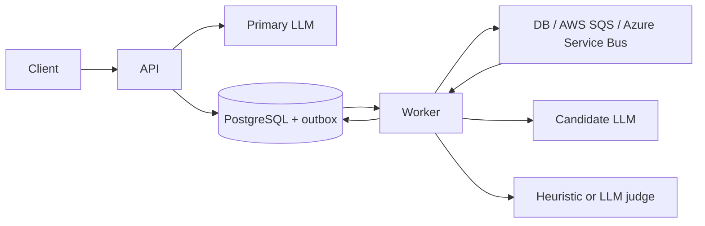

# LLM Shadow Evaluator

A small production-oriented service for evaluating a candidate LLM without
putting it on the customer request path.

1. `POST /evaluate` calls the **primary** model and returns its response.
2. A configurable percentage of responses is stored with a **shadow** job.
3. A separate worker calls the candidate model.
4. The worker creates a separate **score** job and stores a `0-100` comparison.



The database outbox is transactional with each evaluation state change. A
broker outage therefore never delays or loses the primary response; the worker
retries delivery later. Queue processing is at-least-once and each completed
stage is safe to redeliver.

## Run locally

Docker Compose starts PostgreSQL, the API, and one worker:

```bash
docker compose up --build
```

Open the dashboard at <http://localhost:8000>. It can submit prompts, follow
sampled evaluations, and show recent scores. Swagger remains available at
<http://localhost:8000/docs>.

The default uses deterministic mock models and samples every request. Try it:

```bash
curl -X POST http://localhost:8000/api/v1/evaluate \
  -H "Content-Type: application/json" \
  -d '{"prompt":"What is a cloud VM?"}'
```

```json
{
  "response": "[primary] What is a cloud VM?",
  "model": "primary-mock",
  "sampled": true,
  "evaluation_id": "..."
}
```

Fetch the persisted result after the worker finishes:

```bash
curl http://localhost:8000/api/v1/evaluations/{evaluation_id}
curl http://localhost:8000/api/v1/evaluations/{evaluation_id}/comparison
curl http://localhost:8000/api/v1/metrics
```

## Use real models

Copy `.env.example` to `.env`. Both endpoints may be any
OpenAI-compatible provider:

```env
SAMPLE_RATE=0.05

PRIMARY_PROVIDER=openai
PRIMARY_BASE_URL=https://llm-provider.example/v1
PRIMARY_API_KEY=...
PRIMARY_MODEL=primary-model

CANDIDATE_PROVIDER=openai
CANDIDATE_BASE_URL=https://llm-provider.example/v1
CANDIDATE_API_KEY=...
CANDIDATE_MODEL=candidate-model
```

The API key names are role-specific so primary and candidate traffic can use
different providers and credentials.

## Scoring

The scoring stage is a separate queue job, not work performed by the request
or candidate-inference stage.

- `SCORE_BACKEND=heuristic` is free and combines normalized text similarity,
  token overlap, and length ratio.
- `SCORE_BACKEND=llm` uses a deterministic LLM judge and still records the
  lexical metrics. Set `JUDGE_BASE_URL`, `JUDGE_API_KEY`, and `JUDGE_MODEL`.

Scores and the scorer's reason are stored in PostgreSQL with both model
responses, model names, latency, and token usage.

## Queue backends

`QUEUE_BACKEND=database` consumes the PostgreSQL outbox directly. It is the
smallest deployment and works well at modest volume. Use PostgreSQL for
multiple workers; SQLite is intended for one local worker only.

For AWS SQS:

```bash
aws sqs create-queue \
  --queue-name llm-shadow-evaluations \
  --attributes VisibilityTimeout=120
```

```env
QUEUE_BACKEND=sqs
AWS_REGION=us-east-1
SQS_QUEUE_URL=https://sqs.us-east-1.amazonaws.com/.../llm-shadow-evaluations
```

The SDK uses the standard AWS credential chain. [AWS SQS pricing][sqs-pricing]
currently includes one million requests per month at no charge. Configure a
dead-letter queue on the SQS queue for operational inspection.

For Azure Service Bus:

```env
QUEUE_BACKEND=azure
AZURE_SERVICE_BUS_CONNECTION_STRING=...
AZURE_SERVICE_BUS_QUEUE_NAME=llm-shadow-evaluations
```

Keep the broker lock/visibility timeout longer than one model attempt including
SDK retries. The project default is 120 seconds.

## API

| Endpoint | Purpose |
|---|---|
| `POST /api/v1/evaluate` | Return primary output and sample shadow work |
| `GET /api/v1/evaluations?limit=50&offset=0` | List evaluations |
| `GET /api/v1/evaluations/{id}` | Read state and both outputs |
| `GET /api/v1/evaluations/{id}/comparison` | Read the completed score |
| `GET /api/v1/metrics` | Counts and average score |
| `GET /api/v1/health` | Database readiness |

States are `queued -> shadow_running -> score_queued -> scoring -> complete`;
exhausted jobs become `failed`. Candidate and scoring failures retry with
bounded exponential backoff.

## Run without Docker

```bash
python -m venv .venv
# Windows: .venv\Scripts\Activate.ps1
# Linux/macOS: source .venv/bin/activate
pip install -r requirements-dev.txt
cp .env.example .env
uvicorn app.main:app --reload
```

In another terminal:

```bash
python -m app.worker
```

For a no-Docker setup, change `DATABASE_URL` to:

```env
DATABASE_URL=sqlite+aiosqlite:///./evaluator.db
```

## Deployment

Run the same image as two components:

- API: the Dockerfile's default command.
- Worker: `python -m app.worker`.

Use managed PostgreSQL and optionally SQS or Service Bus. Put authentication,
rate limiting, TLS, and request-size limits at the API gateway. Keep secrets in
the platform secret manager, run one schema migration/init step per release,
and alert on `failed` evaluations and outbox backlog.

## Tests

```bash
pytest -q
```

Tests cover sampling isolation, persistence, outbox behavior, worker stage
separation, retries, SQS acknowledgement, and both scoring modes.

[sqs-pricing]: https://aws.amazon.com/sqs/pricing/
